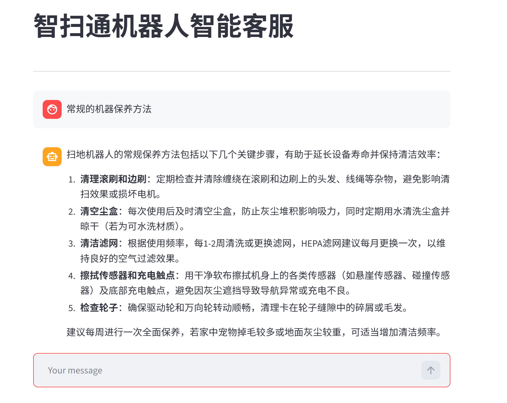
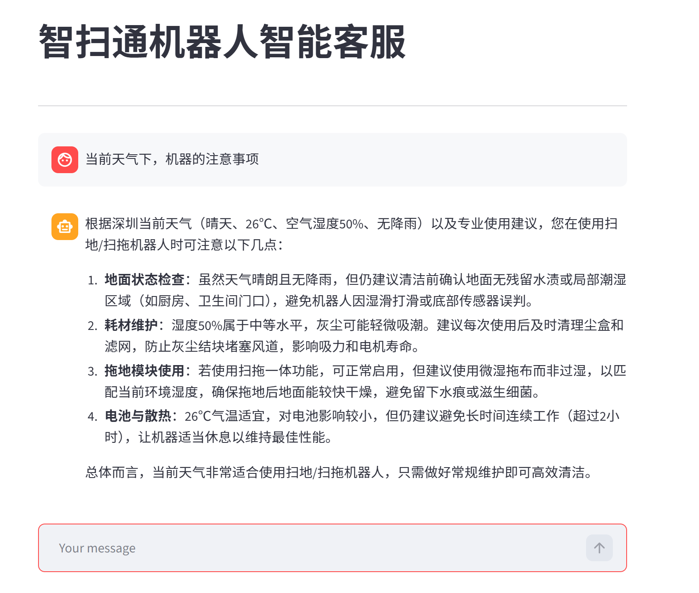
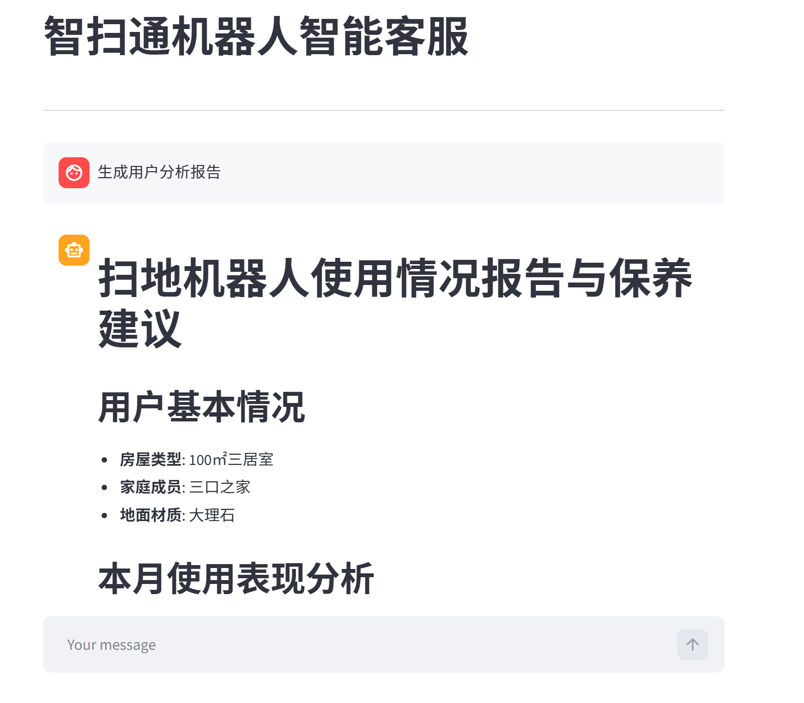

# 🤖 扫地机器人智能客服 AI Agent

基于 LangGraph + FastAPI + React 的垂直领域智能客服系统，专注于扫地机器人场景的智能问答、故障诊断和使用报告生成。

[](https://opensource.org/licenses/MIT)
[](https://www.python.org/downloads/)
[](https://reactjs.org/)
[](https://www.docker.com/)

---

## ✨ 核心特性

### 🧠 LangGraph ReAct Agent
- 基于 **LangGraph** 的 ReAct 智能体，支持多轮推理和工具链调用
- 原生流式输出（token 级），无需手动过滤 "Final Answer"
- **对话记忆**：基于 MemorySaver checkpointer，支持跨轮次上下文记忆
- 多工具并行调用：RAG 检索、天气查询、用户信息获取等

### 📚 RAG 检索增强问答
- 基于 **Chroma** 向量数据库的知识库检索
- 支持 PDF、TXT 等多种文档格式
- 智能文档分块和向量化存储
- 相似度检索 + LLM 生成，提升回答准确性

### 💬 现代化 Web 界面
- **React 18 + TypeScript** 前端，响应式设计
- **实时流式对话**：基于 SSE (Server-Sent Events)
- Markdown 渲染 + 代码高亮（Prism.js）
- 对话历史持久化（localStorage）
- 暗色模式支持

### 🚀 生产级部署
- **Docker + Docker Compose** 一键部署
- Nginx 反向代理 + 静态文件服务
- 完整的阿里云 ECS 部署文档
- 支持传统部署（Nginx + Supervisor）

### 🛠️ 工程化实践
- 模块化架构：Agent / RAG / API / Frontend 分层清晰
- 配置化管理：YAML 配置文件，环境变量隔离
- 日志系统：多级日志记录，便于调试和监控
- 类型安全：TypeScript + Pydantic 数据校验

---

## 📸 效果预览

### 1. 聊天界面
实时流式对话，支持 Markdown 渲染和代码高亮



### 2. Agent 工具调用
展示 Agent 调用 RAG 检索、外部工具的推理过程



### 3. 报告生成
根据用户数据生成个性化使用分析报告



---

## 🏗️ 技术架构

```
用户浏览器
    ↓
Nginx (反向代理 + 静态文件)
    ├─ / → React 前端 (SPA)
    └─ /api → FastAPI 后端
         ↓
    LangGraph ReAct Agent
         ├─ DashScope LLM (通义千问)
         ├─ Chroma 向量数据库
         └─ 工具集 (RAG / 天气 / 用户信息)
```

### 技术栈

| 层级 | 技术选型 |
|------|---------|
| **前端** | React 18 + TypeScript + Vite + TailwindCSS v4 + shadcn/ui |
| **后端** | FastAPI + Uvicorn + Pydantic |
| **AI 框架** | LangChain 0.3.x + LangGraph 0.2.x |
| **LLM** | 阿里云百炼 DashScope (qwen-plus / qwen-max) |
| **Embedding** | text-embedding-v3 (DashScope) |
| **向量库** | Chroma 0.5.x |
| **部署** | Docker + Docker Compose + Nginx |

---

## 📁 项目结构

```
.
├── agent/                       # Agent 核心逻辑
│   ├── react_agent.py           # LangGraph ReAct Agent
│   └── tools/                   # 工具函数集合
│       └── agent_tools.py       # RAG、天气、用户信息等工具
├── api/                         # FastAPI 后端
│   ├── main.py                  # FastAPI 应用入口
│   ├── routers/                 # API 路由
│   │   ├── chat.py              # 聊天接口（SSE 流式）
│   │   └── knowledge.py         # 知识库管理接口
│   ├── database/                # 数据库模型
│   └── schemas/                 # Pydantic 数据模型
├── frontend/                    # React 前端
│   ├── src/
│   │   ├── components/          # React 组件
│   │   ├── pages/               # 页面组件
│   │   ├── stores/              # Zustand 状态管理
│   │   ├── hooks/               # 自定义 Hooks
│   │   └── lib/                 # API 客户端
│   ├── package.json
│   └── vite.config.ts
├── rag/                         # RAG 检索模块
│   ├── rag_service.py           # 检索服务
│   └── vector_store.py          # 向量存储
├── model/                       # LLM 模型工厂
│   └── factory.py               # ChatOpenAI + DashScope 配置
├── config/                      # 配置文件
│   ├── agent.yml                # Agent 配置
│   ├── rag.yml                  # RAG 配置
│   └── prompts.yml              # 提示词模板
├── data/                        # 知识库文档
├── deploy/                      # 部署配置
│   ├── DEPLOYMENT_GUIDE.md      # 部署总指南
│   ├── DOCKER_DEPLOY.md         # Docker 部署文档
│   ├── quick-deploy.sh          # 一键部署脚本
│   ├── nginx.conf               # Nginx 配置
│   └── supervisor.conf          # Supervisor 配置
├── Dockerfile                   # Docker 镜像构建
├── docker-compose.yml           # Docker Compose 配置
├── start_api.py                 # FastAPI 启动脚本
├── init_db.py                   # 向量数据库初始化
├── requirements.txt             # Python 依赖
└── README.md
```

---

## 🚀 快速开始

### 方式 1：Docker 部署（推荐）

**前置要求**：
- Docker 和 Docker Compose
- DashScope API Key（[申请地址](https://dashscope.console.aliyun.com/)）

**部署步骤**：

```bash
# 1. 克隆项目
git clone https://github.com/benzunyinzi-boop/robot-vacuum-customer-agent.git
cd robot-vacuum-customer-agent

# 2. 配置环境变量
cat > .env <<EOF
DASHSCOPE_API_KEY=sk-your-api-key-here
LOG_LEVEL=INFO
EOF

# 3. 初始化向量数据库
docker-compose run --rm app python init_db.py

# 4. 启动服务
docker-compose up -d --build

# 5. 查看日志
docker-compose logs -f

# 6. 访问应用
# 前端：http://localhost
# API 文档：http://localhost/api/docs
```

### 方式 2：本地开发

**前置要求**：
- Python 3.9+
- Node.js 18+
- DashScope API Key

**后端启动**：

```bash
# 1. 创建虚拟环境
python3.9 -m venv venv
source venv/bin/activate  # Windows: venv\Scripts\activate

# 2. 安装依赖
pip install -r requirements.txt

# 3. 配置环境变量
export DASHSCOPE_API_KEY="sk-your-api-key-here"

# 4. 初始化向量数据库
python init_db.py

# 5. 启动 FastAPI
python start_api.py
# 访问 http://localhost:8000
```

**前端启动**：

```bash
# 1. 进入前端目录
cd frontend

# 2. 安装依赖
npm install

# 3. 启动开发服务器
npm run dev
# 访问 http://localhost:3000
```

---

## 🌐 部署到阿里云 ECS

### 一键部署（5 分钟）

```bash
# SSH 连接到 ECS
ssh root@YOUR_ECS_IP

# 运行一键部署脚本
curl -fsSL https://raw.githubusercontent.com/benzunyinzi-boop/robot-vacuum-customer-agent/main/deploy/quick-deploy.sh | bash
```

### 详细部署文档

- 📘 [部署总指南](deploy/DEPLOYMENT_GUIDE.md) - 两种部署方式对比
- 🐳 [Docker 部署](deploy/DOCKER_DEPLOY.md) - Docker 详细步骤
- 📖 [传统部署](deploy/README.md) - Nginx + Supervisor
- ✅ [部署检查清单](deploy/CHECKLIST.md) - 上线前检查

### 配置要求

| 配置 | 最低要求 | 推荐配置 |
|------|---------|---------|
| CPU | 2核 | 4核 |
| 内存 | 2GB (需加 swap) | 4GB+ |
| 磁盘 | 40GB | 80GB |
| 带宽 | 1Mbps | 5Mbps |

---

## 🎯 支持的功能

### 1. 智能问答
- **知识库检索**：基于 RAG 的文档问答
- **多轮对话**：支持上下文记忆，理解前后文关系
- **工具调用**：自动调用外部工具获取实时信息

**示例问题**：
```
- 扫地机器人有哪些主要功能？
- 如果机器人无法正常回充，该如何处理？
- 今天北京的天气怎么样？
```

### 2. 故障诊断
- 基于知识库的故障排查指南
- 分步骤引导用户解决问题
- 支持图文并茂的操作说明

### 3. 报告生成
- 根据用户数据生成个性化使用报告
- 动态提示词切换，适配不同任务场景
- 结构化输出，便于阅读和分享

**示例指令**：
```
请根据我的使用数据生成一份月度使用报告
```

### 4. 知识库管理
- 支持上传 PDF、TXT 等文档
- 自动向量化并存储到 Chroma
- 支持文档列表查看和删除

---

## ⚙️ 配置说明

### 环境变量（.env）

```bash
# DashScope API Key（必填）
DASHSCOPE_API_KEY=sk-your-api-key-here

# 日志级别（可选）
LOG_LEVEL=INFO  # DEBUG / INFO / WARNING / ERROR
```

### Agent 配置（config/agent.yml）

```yaml
model_name: qwen-plus  # 或 qwen-max
temperature: 0.7
max_tokens: 2000
```

### RAG 配置（config/rag.yml）

```yaml
chunk_size: 500
chunk_overlap: 50
top_k: 3  # 检索 Top-K 文档
```

### 提示词配置（config/prompts.yml）

```yaml
system_prompt: |
  你是智扫通扫地机器人的智能客服助手...
```

---

## 🔧 常用命令

### Docker 部署

```bash
# 查看服务状态
docker-compose ps

# 查看日志
docker-compose logs -f app

# 重启服务
docker-compose restart

# 停止服务
docker-compose down

# 更新代码
git pull origin main
docker-compose up -d --build
```

### 本地开发

```bash
# 后端热重载
uvicorn api.main:app --reload --host 0.0.0.0 --port 8000

# 前端热重载
cd frontend && npm run dev

# 初始化/更新向量数据库
python init_db.py
```

---

## 🧪 测试

### 测试 API

```bash
# 健康检查
curl http://localhost:8000/api/v1/health

# 测试流式聊天
curl -N -X POST http://localhost:8000/api/v1/chat/stream \
  -H "Content-Type: application/json" \
  -d '{"message":"扫地机器人主要功能有哪些？"}'
```

### 测试前端

访问 http://localhost:3000，尝试以下操作：
1. 发送消息，验证流式输出
2. 刷新页面，验证对话历史持久化
3. 上传文档到知识库
4. 切换暗色/亮色模式

---

## 📝 开发指南

### 添加新工具

在 `agent/tools/agent_tools.py` 中定义新工具：

```python
from langchain.tools import tool

@tool
def your_new_tool(query: str) -> str:
    """工具描述，Agent 会根据这个描述决定何时调用"""
    # 实现工具逻辑
    return "工具返回结果"
```

然后在 `agent/react_agent.py` 中注册：

```python
self.agent = create_react_agent(
    model=chat_model,
    tools=[rag_summarize, your_new_tool, ...],  # 添加新工具
    checkpointer=self.checkpointer,
)
```

### 添加新 API 接口

在 `api/routers/` 下创建新路由文件，然后在 `api/main.py` 中注册：

```python
from api.routers import your_router

app.include_router(your_router.router, prefix="/api/v1")
```

### 修改前端样式

前端使用 TailwindCSS v4，直接在组件中使用 utility classes：

```tsx
<div className="bg-gray-900 text-white p-4 rounded-lg">
  Your content
</div>
```

---

## 🐛 故障排查

### 问题 1：服务无法启动

```bash
# Docker 部署
docker-compose logs app

# 本地部署
python start_api.py  # 查看详细错误
```

### 问题 2：API 调用失败

```bash
# 检查 API Key
cat .env

# 测试 DashScope 连通性
curl -X POST https://dashscope.aliyuncs.com/compatible-mode/v1/chat/completions \
  -H "Authorization: Bearer YOUR_API_KEY" \
  -H "Content-Type: application/json" \
  -d '{"model":"qwen-plus","messages":[{"role":"user","content":"hi"}]}'
```

### 问题 3：前端无法连接后端

检查 `frontend/src/lib/api.ts` 中的 API 地址配置：

```typescript
const API_BASE_URL = import.meta.env.VITE_API_URL || 'http://localhost:8000';
```

---

## 🤝 贡献指南

欢迎提交 Issue 和 Pull Request！

1. Fork 本仓库
2. 创建特性分支：`git checkout -b feature/your-feature`
3. 提交改动：`git commit -m "Add your feature"`
4. 推送分支：`git push origin feature/your-feature`
5. 提交 Pull Request

---

## 📄 License

本项目采用 [MIT License](LICENSE) 开源协议。

---

## 🙏 致谢

- [LangChain](https://github.com/langchain-ai/langchain) / [LangGraph](https://github.com/langchain-ai/langgraph) - AI Agent 框架
- [FastAPI](https://fastapi.tiangolo.com/) - 现代化 Python Web 框架
- [React](https://reactjs.org/) - 前端框架
- [Chroma](https://www.trychroma.com/) - 向量数据库
- [Alibaba Cloud DashScope](https://dashscope.aliyuncs.com/) - 大语言模型服务
- [shadcn/ui](https://ui.shadcn.com/) - React 组件库

---

## ⭐ Star History

如果这个项目对你有帮助，欢迎点个 Star！

---

## 📮 联系方式

- GitHub Issues: [提交问题](https://github.com/benzunyinzi-boop/robot-vacuum-customer-agent/issues)
- Email: benzunyinzi@gmail.com

---

**Built with ❤️ by benzunyinzi**
